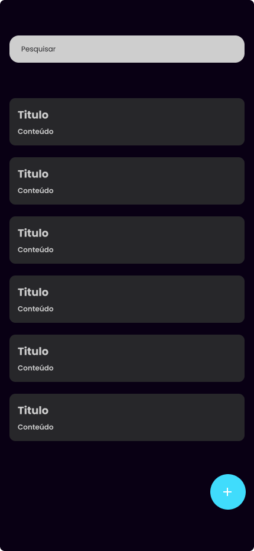
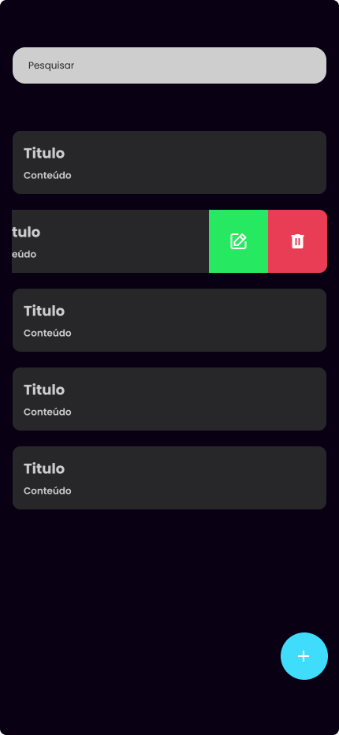

# Projeto de App de Notas com SQLite e Expo Router

Este projeto é um aplicativo de notas desenvolvido com React Native, Expo, e utilizando o Expo Router para navegação. Ele permite criar, visualizar, editar e deletar notas, e usa uma base de dados SQLite para armazenar as informações localmente no dispositivo.

---

## Funcionalidades

- **CRUD de Notas:** Criação, leitura, edição e exclusão de notas.
- **Busca por Título:** Pesquisa rápida para encontrar notas específicas.
- **Confirmação para Deletar:** Confirmação antes da exclusão de qualquer nota para evitar exclusões acidentais.
- **Uso de Bottom Sheet:** Utiliza um "Bottom Sheet" para criar e editar detalhes de notas.
- **Armazenamento Local com SQLite:** Persistência de dados localmente para acessar as notas.

---

## Demonstração Visual

### Tela Inicial

A tela inicial exibe uma lista das notas salvas com a possibilidade de editar ou deletar diretamente ao arrastar o card para o lado.

### Tela de Exclusão

Confirmação visual antes de excluir qualquer nota.

### Tela de Notas

Tela detalhada de visualização da nota, exibindo o título, o conteúdo e a data de criação.

---

## Tecnologias Utilizadas

- **React Native** e **Expo**
- **Expo Router:** Para navegação entre telas.
- **SQLite:** Persistência local dos dados.
- **React Native Gesture Handler e Reanimated:** Para gestos de swipe nas ações de editar e deletar notas.
